# Project 2 — Conditional Lead-Lag Alpha

A risk-constrained long-short equity strategy built on industry lead-lag effects.
UC Berkeley MFE · Equity Markets (MFE 230G) · CRSP daily data, 1996–2024.

**Team:** Elias Roubache, Connor O'Rourke, Reza Zamani, Thomas Claudel, Paraj Goyal.

> **Bottom line.** Large-cap industry leaders do predict their smaller followers' next-day returns, and that predictability comes from the **common (industry/market) part** of the leader's move, not the leader-specific shock. But the effect is concentrated in 1996–2006, the proposed conditional signal does not beat simpler baselines, and once the portfolio is made dollar-, beta- and own-lag-neutral, traded from the open, and charged realistic costs, nothing is left.
> **Verdict: do not implement.**

---

## Contents

1. [Purpose](#1-purpose)
2. [Process](#2-process)
3. [Research question](#3-research-question)
4. [Hypotheses](#4-hypotheses)
5. [Data & universe](#5-data--universe)
6. [Results — Part 1: Baseline lead-lag](#6-results--part-1-baseline-lead-lag)
7. [Results — Part 2: Decomposing the leader's move](#7-results--part-2-decomposing-the-leaders-move)
8. [Results — Part 3: Conditional signal and validation](#8-results--part-3-conditional-signal-and-validation)
9. [Results — Part 4: Portfolio construction, risk and costs](#9-results--part-4-portfolio-construction-risk-and-costs)
10. [Results — Part 5: Robustness](#10-results--part-5-robustness)
11. [Summary of findings](#11-summary-of-findings)
12. [Known limits](#12-known-limits)
13. [Reproducing the results](#13-reproducing-the-results)
14. [Repository structure](#14-repository-structure)

---

## 1. Purpose

Industry lead-lag is a well-documented effect: large firms' returns predict the later returns of smaller firms in the same industry, usually attributed to slow diffusion of information. This project tests a sharper version of that idea — that the *direction* of a follower's response should depend on *why* the leader moved. If the leader's move reflects news about the whole industry, followers should continue in the same direction. If the move is specific to the leader (a one-off earnings surprise, a lawsuit, a management change), followers dragged along on no real news of their own should revert instead.

The purpose of the project is to build and test that conditional signal end to end — construct it, validate it against simpler baselines, turn it into an implementable portfolio with realistic risk controls and costs, and stress-test the result — and to reach a clear implement / do-not-implement verdict, with ChatGPT used throughout as a research assistant for idea generation, code, and robustness design.

## 2. Process

The five parts were not built independently and combined at the end — each depended on a signed-off handoff from the one before, and key design decisions were locked in writing *before* results existed.

| Stage | What happened |
|---|---|
| **Part 1** | Built the shared data layer: CRSP universe, point-in-time industry assignment, leader/follower roles, the baseline regression. Shipped with explicit guarantees and three documented "traps" for the rest of the team, in [`docs/part1_handoff.md`](docs/part1_handoff.md) and [`docs/STATUS.md`](docs/STATUS.md). |
| **Part 2** | Built the shock decomposition on top of Part 1's `p1_roles.parquet` and `p1_industry_returns.parquet`, rebuilding the industry index *ex-leader* per the handoff doc's warning (regressing the leader on an index that includes it would shrink its own residual toward zero). |
| **Part 3** | Built the conditional signal on Part 2's output and validated it against two baselines. A timing bug was found and fixed mid-project — an earlier version tested the signal with a two-day gap instead of one, which made it look like pure noise. Commit `1c1544b` fixed it; every Part 3 number in this README is the corrected version. |
| **Part 4** | **Pre-registered before any result existed** — [`docs/part4_prereg.md`](docs/part4_prereg.md) fixed the signals, timing conventions, construction rules, metrics, and the three-criterion decision rule in advance. After the first real run, an **independent three-reviewer code audit** found ten defects (cost accounting, lagging logic, a missing-return edge case, etc.), each logged with cause and effect in [`docs/part4_deviations.md`](docs/part4_deviations.md). None of the fixes changed the verdict. |
| **Part 5** | Ran entirely on Part 4's committed daily book returns (`results/p4_portfolio_daily.csv`) — no new licensed data needed — against a pass/fail rule fixed before the numbers were run. |

## 3. Research question

**When a dominant large-cap stock moves, should smaller firms in the same industry continue in the same direction, or reverse — and does knowing *why* the leader moved (industry-wide news vs. a leader-specific shock) let us build a better signal than just knowing *that* it moved?**

## 4. Hypotheses

| # | Hypothesis | Tested in | Outcome |
|---|---|---|---|
| H1 | Followers **continue** on the common (industry/market) component of the leader's move | Parts 2–3 | ✅ Supported |
| H2 | Followers **revert** on the leader-specific shock | Parts 2–3 | ❌ Not supported |
| H3 | Conditioning on the source of the move beats unconditional signals and short-term reversal | Parts 3–4 | ❌ Rejected |
| H4 | The signal stays economically meaningful after risk controls, turnover and costs | Parts 4–5 | ❌ Rejected |

## 5. Data & universe

| Item | Detail |
|---|---|
| Source | CRSP daily stock file, delistings, name history, Fama-French 5 factors + momentum (via WRDS); Databento intraday quotes (pilot) |
| Sample | 1996–2024; 34.4M CRSP rows; 7,173 trading sessions |
| Industries | Fama-French 49, assigned **point-in-time** from CRSP name history (not header SIC) |
| Universe | Monthly, 5 screens (observation count, $5 price floor, NYSE size floor, liquidity, excluding industry "Other"): **~1,747 eligible stocks per month** on average |
| Leaders / followers | Leader = largest firm in each industry, chosen with data through month *m−1*; all other eligible firms are followers (5.4% monthly leader turnover) |
| Regression panel | **12.4M follower-days** |
| Survivorship | Delisting returns merged in (incl. non-trading days); Shumway substitute for 417 missing performance delistings, flagged |
| Look-ahead controls | Every conditioning characteristic is taken at the previous close (the "d−1 rule"); `(date, permno)` uniqueness enforced |

Licensed data (CRSP extracts, stock-level panels) is **not** in this repository; everything is regenerated from code (see [§14](#14-reproducing-the-results)). Only aggregate result tables are committed.

| Universe attrition | Stocks per year |
|---|---|
| 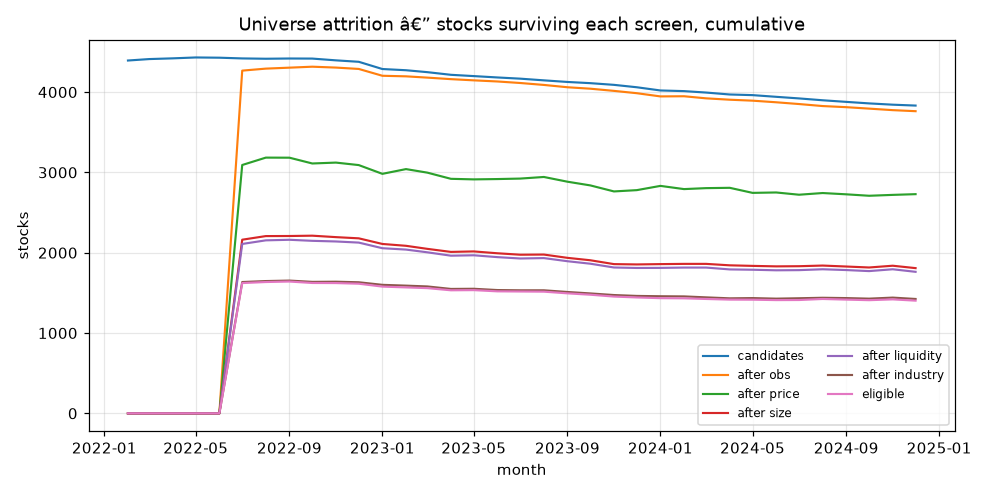 | 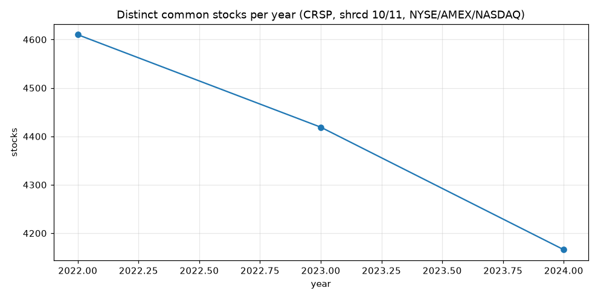 |

| Industry sizes |
|---|
| 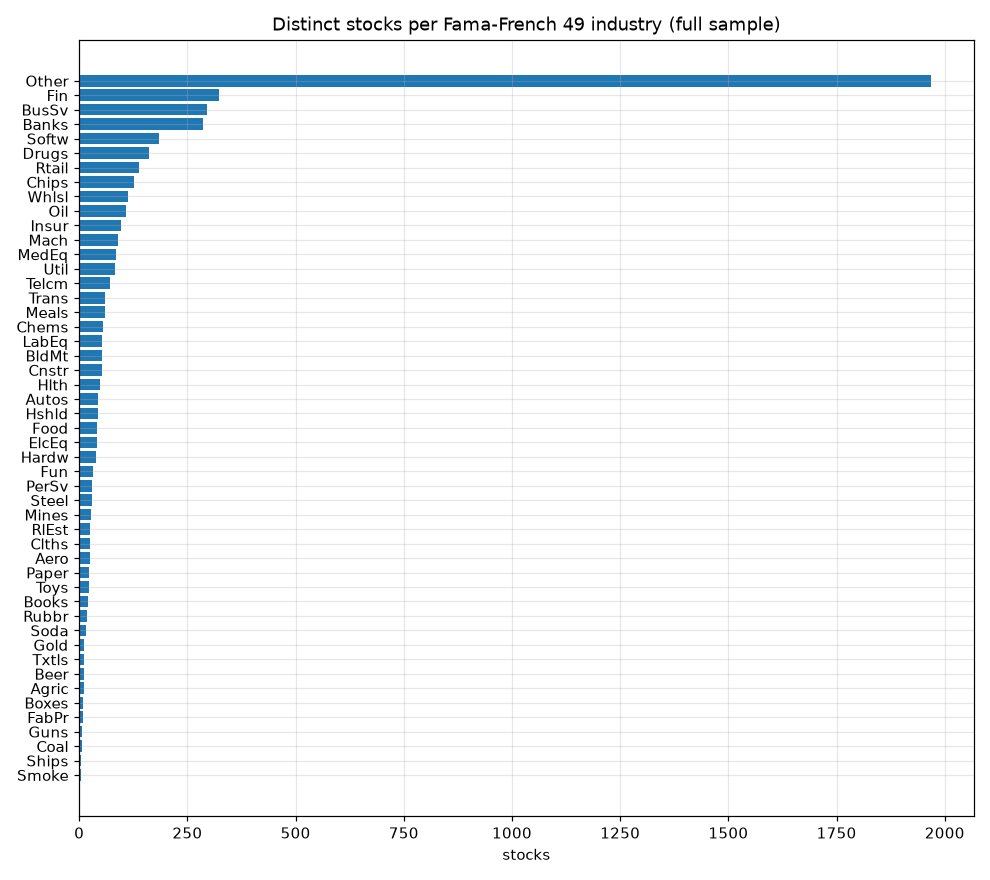 |

## 6. Results — Part 1: Baseline lead-lag

**Model.** Daily Fama-MacBeth cross-sectional regressions of follower returns on the industry leader's lagged return, controlling for the follower's own lagged return, with Newey-West standard errors (pooled, date-clustered estimates as a check):

$$r_{i,t} = a_t + b_t\, r_{L(i),\,t-k} + c_t\, r_{i,\,t-k} + \varepsilon_{i,t}$$

**Table — coefficient by lag.**

| Lag *k* | β (Fama-MacBeth) | t | β (pooled, clustered) | t |
|---|---|---|---|---|
| 1 | +0.00928 | **5.03** | +0.02202 | 6.84 |
| 2 | +0.00122 | 0.72 | +0.01199 | 3.84 |
| 3 | −0.00050 | −0.30 | +0.00207 | 0.64 |

**Table — microstructure check (lag 1).**

| Return measure | β_FM | t | 1996–2006 | 2007–2024 |
|---|---|---|---|---|
| Close-to-close | 0.00928 | 5.03 | 0.0206 (t 7.97) | 0.0025 (t 1.02) |
| Close, ex-dividend | 0.00912 | 4.96 | 0.0206 (t 7.97) | 0.0022 (t 0.92) |
| **Bid-ask midpoint** | **0.00963** | **5.19** | **0.0220 (t 8.12)** | 0.0022 (t 0.93) |

**Findings.**
- **Continuation, not reversal**, and it lasts one day. A quintile sort on the leader's lagged return is monotone, top-minus-bottom spread 3.59 bps/day (t = 4.34).
- **Concentrated in 1996–2006:** β = 0.0206 (t = 7.97) then, versus 0.0025 (t = 1.02) in 2007–2024, as median relative spreads fell from 3.23% to 0.11%.
- **Not bid-ask bounce:** rebuilt on bid-ask midpoint returns, β barely moves (0.00963 vs. 0.00928).
- An intraday pilot (Databento 5-minute midpoints, June 2023, 22 stocks) validated the pipeline but was not significant (β = −0.044, t = −1.67).

**Figures.**

| Coefficient by year | Quintile sort |
|---|---|
| 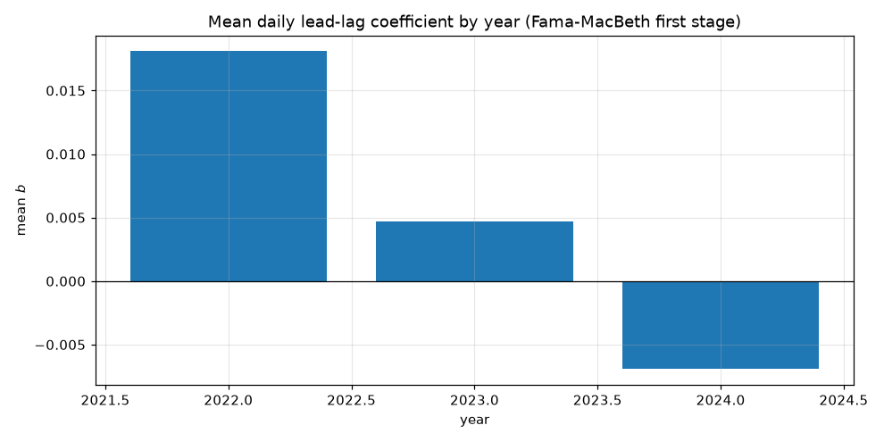 | 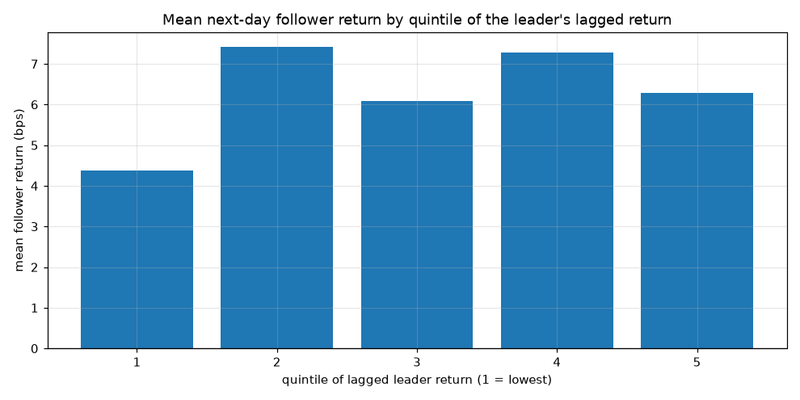 |

| Horizon profile |
|---|
| 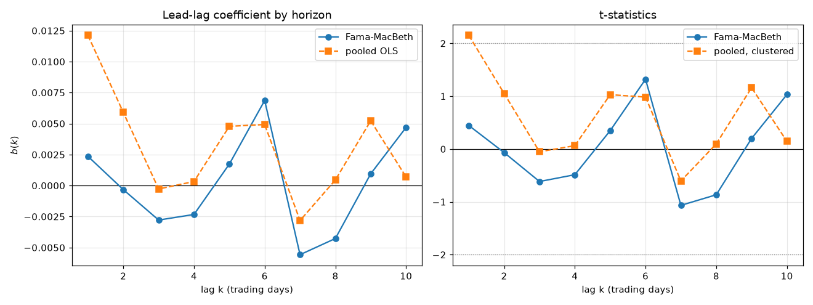 |

Details: [`docs/STATUS.md`](docs/STATUS.md), [`docs/part1_handoff.md`](docs/part1_handoff.md).

## 7. Results — Part 2: Decomposing the leader's move

**Model.** Each day, split the leader's return into a **common** part explained by the market and an **ex-leader** industry index, and a **leader-specific** residual. The regression is rolling and point-in-time, and the industry index excludes the leader so the residual isn't shrunk toward zero:

$$r_{L,t} = \alpha + \beta_m\, \text{MKT}_t + \beta_j\, \text{IND}^{\text{ex-leader}}_{j,t} + u_{L,t}, \qquad \text{common}_t = r_{L,t} - u_{L,t}, \quad \text{shock}_t = u_{L,t}$$

Followers' responses to each component are then estimated with Fama-MacBeth regressions:

$$r_{i,t} = a_t + b_c\, \text{common}_{t-k} + b_u\, \text{shock}_{t-k} + c\, r_{i,t-k} + \varepsilon_{i,t}$$

**Table — results (lag 1, Fama-MacBeth).**

| Coefficient | Estimate | t |
|---|---|---|
| b_common | **0.0396** | **7.70** |
| b_shock | 0.0034 | 1.86 |
| b_common − b_shock | 0.0362 | 6.90 |

**Findings.**
- Followers respond strongly to the **common** component and barely to the leader-specific shock — supports **H1**.
- The shock coefficient is **positive**, the wrong sign for the reversal in **H2**.
- The common component explains only about **40%** of a leader's daily variance on average (median across 48 industries: 38%) — so the predictability comes from the smaller share of the move.

**Figures.**

| Common vs. shock response | Variance shares |
|---|---|
| 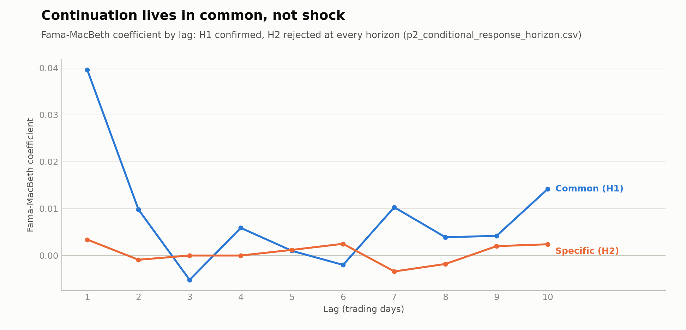 | 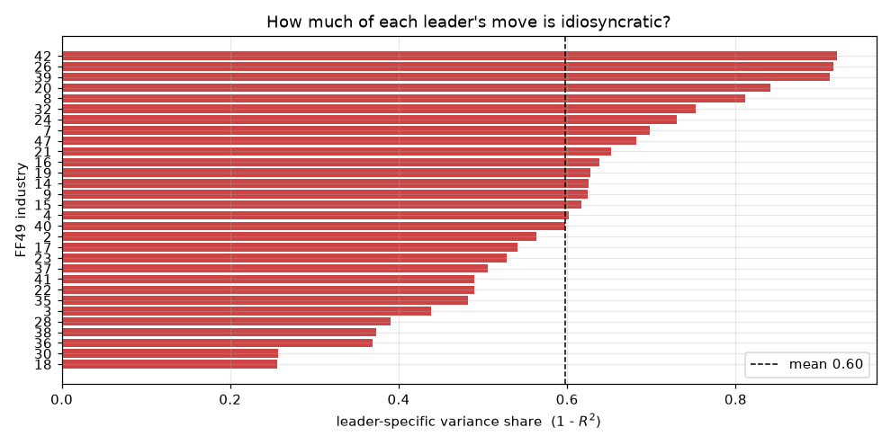 |

| Horizon profile | Rolling betas |
|---|---|
| 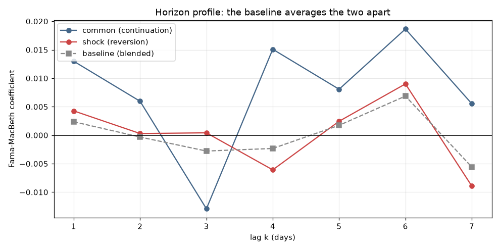 | 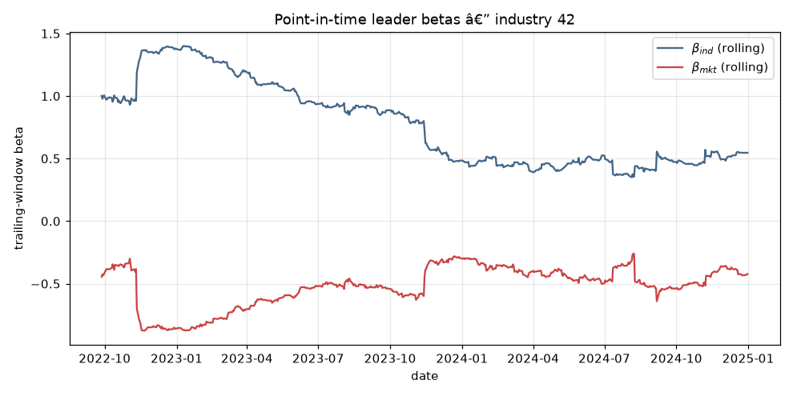 |

| Sign flip | Recovery |
|---|---|
| 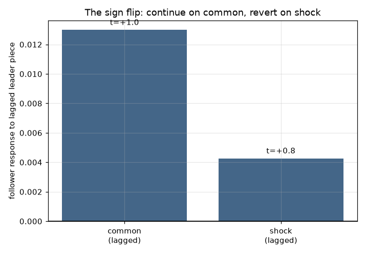 | 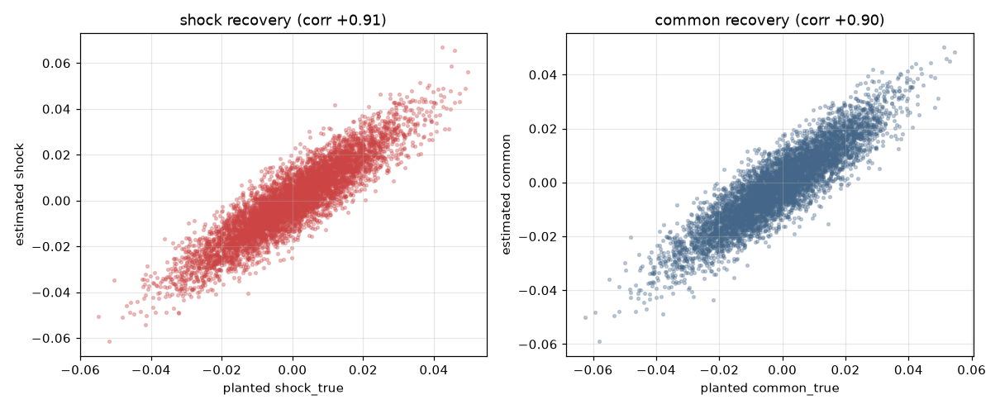 |

| Ex-leader scatter | Leader robustness |
|---|---|
| 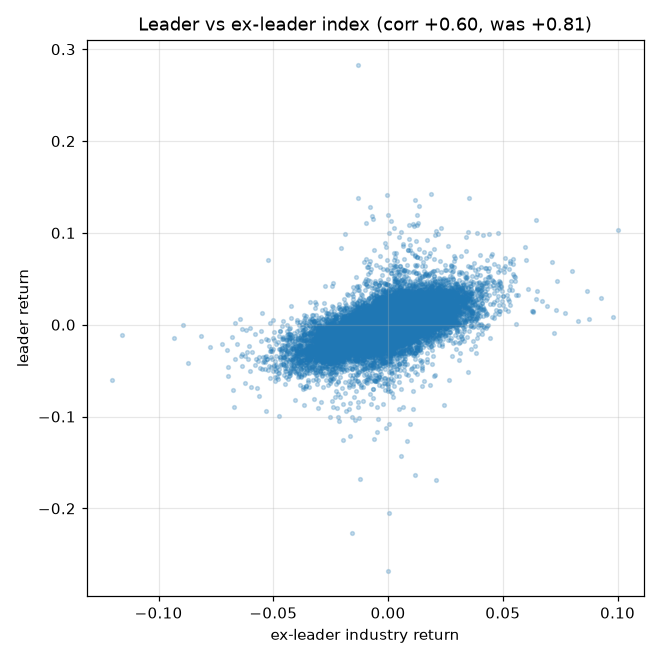 | 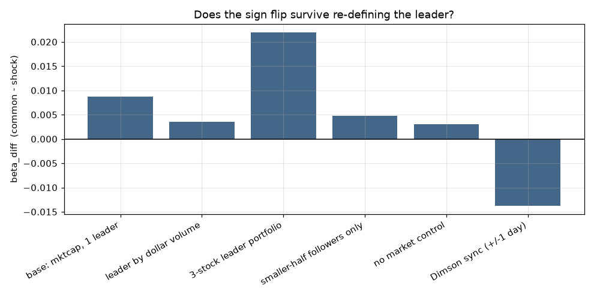 |

## 8. Results — Part 3: Conditional signal and validation

**Signal.** One rankable number per follower-day, combining H1 and H2:

$$\text{conditional\_signal} = \text{common\_lag} - \text{shock\_lag}$$

Each leg is also tested alone, against two baselines: the unconditional Part 1 leader signal (`leader_ret_lag`) and naive own-return reversal (`−own_lag`).

**Validation.** Daily cross-sectional Spearman rank IC at horizons of 1, 5, 10 and 20 days, plus equal-weighted quintile long-short portfolios at h = 1. The signal is known at day *t*'s close and tested on the return from *t* to *t+1*.

**Table — results (h = 1).**

| Signal | Mean IC | IC t-stat | Long-short (bps/day) | Long-short t-stat |
|---|---|---|---|---|
| Composite (common − shock) | 0.0010 | 0.93 | 3.0 | 3.72 |
| **Common leg** | **0.0049** | **3.52** | **7.1** | **6.76** |
| Shock leg (raw sign) | 0.0007 | 0.72 | 0.5 | 0.76 |
| Part 1 baseline (leader return) | 0.0021 | 1.87 | 3.4 | 3.91 |
| Naive own-return reversal | 0.0166 | 10.91 | 3.8 | 3.23 |

**Findings.**
- The **common leg** is the strongest leader-based signal: it doubles the Part 1 baseline's spread.
- The **shock leg** is flat, so subtracting it **dilutes** the composite, which falls below both baselines. **H3 is rejected.**
- Naive reversal leads on IC, but its spread is about half the common leg's, and its top quintile is the most volatile (consistent with small, illiquid stocks).

**Figures.**

| IC by horizon |
|---|
| 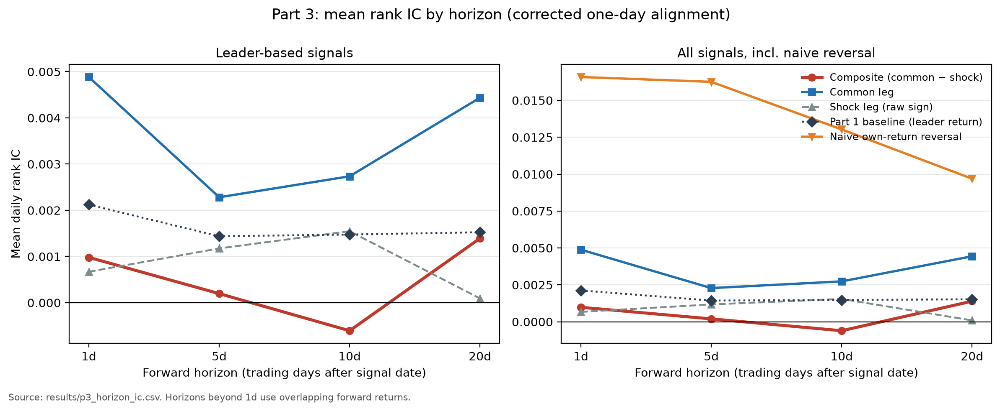 |

| Quintile monotonicity |
|---|
| 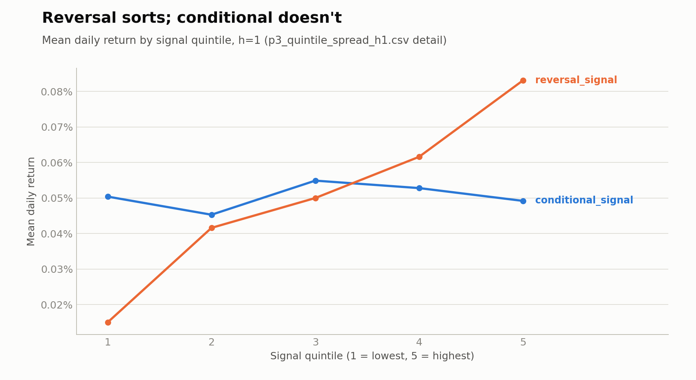 |

> **Timing correction.** An earlier version tested the signal with a two-day gap (the leader's move on *t−1* against the return on *t+1*), which made it look like noise (composite −0.12 bps/day, t −0.16). Commit `1c1544b` fixed this (`lag=0`); all numbers above are corrected. Parts 1, 2 and 4 were not affected.

## 9. Results — Part 4: Portfolio construction, risk and costs

Design fixed in [`docs/part4_prereg.md`](docs/part4_prereg.md) before any result existed; changes after a post-hoc code audit are in [`docs/part4_deviations.md`](docs/part4_deviations.md) — none change the verdict.

**Construction.**
- **Industry books** (`conditional_signal`, `common_lag`; appendix: `leader_ret_lag`, `shock_lag`): each day, rank industries by the signal and demean the ranks. Project out dollar, market-beta and own-lag exposure, split each industry's weight equally across its followers, scale gross exposure to 1.
- **Reversal benchmark:** stock-level ranks of `−own_lag`, made dollar-, industry- and beta-neutral.
- **Beta:** Dimson (1979) over 252 sessions, shrunk halfway to 1.
- **Signal timing:** the leader's move is lagged one session on the trading calendar, using only information to the close of *t−1*.

**Table — holding conventions.**

| | Holding period | Role |
|---|---|---|
| **C** | open *t* → close *t* | **Headline** — implementable with market-on-open orders |
| A | close *t−1* → close *t* | Upper bound — requires trading at the signal's own close |
| Overnight | close *t−1* → open *t* | Decomposition |

**Table — primary tests** (annualized mean, Newey-West t, Holm-corrected).

| Book | Convention | Ann. mean | t | Holm p |
|---|---|---|---|---|
| conditional_signal | C | −0.46% | −1.08 | 0.28 |
| conditional_signal | A | −0.70% | −1.48 | 0.28 |
| common_lag | C | +0.85% | 1.90 | 0.17 |
| common_lag | A | +1.19% | 2.39 | 0.07 |

**Table — decision rule** (all three needed for the headline book).

| Criterion | Result | Passed |
|---|---|---|
| 1. Mean return > 0, Holm p < 0.05 | −0.46%/yr, Holm p = 0.28 | ❌ |
| 2. Spanning alpha > 0 vs. reversal book (open-to-close market) | −0.46%/yr, p = 0.29 | ❌ |
| 3. Breakeven cost > median half-spread (2007–2024) | −0.09 bp vs. 2.58 bp | ❌ |
| **Verdict** | | **DO NOT IMPLEMENT** |

**Findings.**
- Every leader-based book breaks even at **0.17 bp or less** one-way, against a median half-spread of **2.58 bp** — more than an order of magnitude short.
- In an exploratory (non-pre-registered) analysis adding constraints one at a time, `common_lag` earns 4.6%/yr (t 5.6) when only dollar-neutral, but just 0.9%/yr (t 1.9) once also beta- and own-lag-neutral — most of the raw signal is market-beta and own-return exposure, not new information.
- The headline book runs at only **2.3%** annual volatility; a 10% target would need 4.3× leverage, so the 3× cap binds. 99% historical VaR is **rejected** by the Kupiec test (99 exceedances vs. 69 expected).

**Figures.**

| Cumulative return | Drawdown |
|---|---|
| 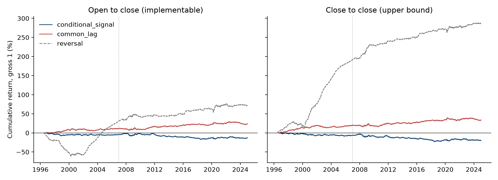 | 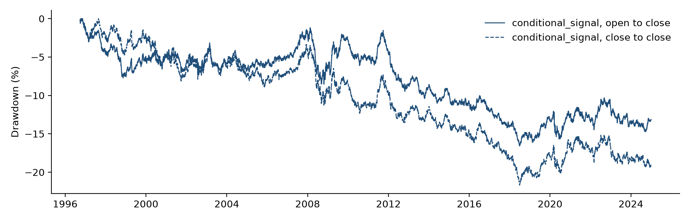 |

| Timing decomposition |
|---|
| 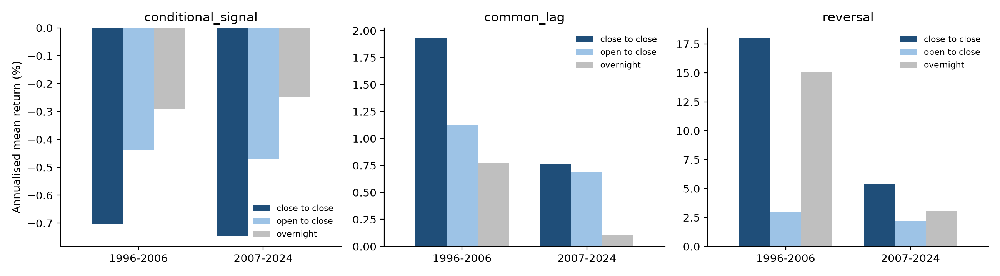 |

Report: [`report/Part4_Portfolio_Construction_and_Risk.pdf`](report/Part4_Portfolio_Construction_and_Risk.pdf).

## 10. Results — Part 5: Robustness

Runs on Part 4's committed daily book returns (`results/p4_portfolio_daily.csv`) — needs no licensed data. Pass/fail rule fixed before the numbers were run ([`appendix/chatgpt_p5.md`](appendix/chatgpt_p5.md)): the verdict is overturned only if a book keeps a positive net return at the 2007–2024 median half-spread with **zero market impact** — the most favourable cost case.

**Table — net return per year, convention C, 2007–2024, by one-way cost.**

| Book | No cost | 0.1 bp | 0.5 bp | 1 bp | **2.58 bp** (median half-spread) |
|---|---|---|---|---|---|
| conditional_signal | −0.5% | −1.0% | −3.0% | −5.5% | **−13.5%** |
| common_lag | +0.7% | +0.2% | −1.8% | −4.3% | **−12.3%** |
| leader_ret_lag | +0.6% | +0.1% | −1.9% | −4.4% | **−12.4%** |
| shock_lag | +0.8% | +0.3% | −1.7% | −4.3% | **−12.2%** |
| reversal | +2.2% | +1.7% | −0.3% | −2.8% | **−10.8%** |

**Table — pseudo-out-of-sample split, convention C.**

| Book | 1996–2006 | 2007–2024 | Positive calendar years |
|---|---|---|---|
| conditional_signal | −0.4% (t −0.7) | −0.5% (t −0.9) | 12 of 29 |
| common_lag | +1.1% (t 1.6) | +0.7% (t 1.2) | 19 of 29 |
| leader_ret_lag | +1.1% (t 1.6) | +0.6% (t 1.1) | 18 of 29 |

**Findings.**
- **No book passes.** At the median half-spread every book loses between 10.8% and 13.5% a year. Carried close-to-close (convention A), leader-based books still lose 7% to 9% a year.
- **Bounce does not drive the lead-lag books** (headline book: −0.78%/yr on midpoints vs. −0.70%/yr on closes); **bounce does drive the reversal benchmark** (10.1%/yr on closes, 1.9%/yr on midpoints — about 7.5 of its 10.1 points arrive overnight).
- No holdout was reserved, so every split above is pseudo-out-of-sample; no leader-based book is significant in 2007–2024 even before costs.
- No figures for Part 5 — it is a pure numerical robustness pass on Part 4's committed book returns; see `results/p5_*.csv`.

| Criterion (every book, convention C, 2007–2024) | Result | Passed |
|---|---|---|
| Net return > 0 at the median half-spread, zero impact | −10.8% to −13.5%/yr | ❌ |
| **Verdict** | | **DO NOT IMPLEMENT** (confirmed) |

Final report: [`report/Conditional_Lead_Lag_Alpha_Final_Report.pdf`](report/Conditional_Lead_Lag_Alpha_Final_Report.pdf).

## 11. Summary of findings

1. **Lead-lag exists:** leaders' returns predict followers' next-day returns (β = 0.0093, t = 5.03). It is continuation, not reversal, and not bid-ask bounce.
2. **It is fading:** almost all of it is in 1996–2006 and statistically absent after 2007.
3. **The information is in the common component:** followers respond to the industry/market part of the leader's move (t = 7.70), not to the leader-specific shock.
4. **The proposed conditional signal fails:** the shock leg adds noise, so the composite underperforms the plain common leg and both baselines.
5. **It is not tradable:** after neutralizing beta and own-lag, trading from the open, and charging realistic costs, every leader-based book earns less than a tenth of its trading cost.
6. **The verdict is robust:** paying the median half-spread with zero impact, every book loses 10.8% to 13.5% a year, and no leader-based book is significant in 2007–2024 even before costs.

## 12. Known limits

- No full factor risk model — books are sized by gross exposure and realized volatility only; the industry books rest on ~48 independent bets a day.
- Costs use closing quoted spreads; opening/closing auction costs and market impact aren't modeled.
- Fama-French factors exist only close-to-close, so the open-to-close attribution is approximate beyond the market factor.
- No genuine out-of-sample test — every split uses data already examined during development. A real test needs post-December-2024 data with the specification locked.
- Non-synchronous trading isn't fully cleared — the direct test needs intraday quotes, which only cover 2018–2024, when the effect is already absent.
- Long/short legs separately, profit concentration by industry, and leave-one-industry-out checks weren't run (need stock-level weights).

## 13. Reproducing the results

Use a dedicated **Python 3.12** environment. Do not install into a shared base environment: `wrds` pins an older pandas, which can break other projects.

```bash
uv venv .venv --python 3.12
uv pip install --python .venv/bin/python -r requirements.txt
[ -f .env ] || cp .env.example .env    # only if you have no .env yet; then add WRDS_USERNAME / WRDS_PASSWORD
.venv/bin/python scripts/run_part1.py  # ~45 min first run (pulls CRSP into cache.nosync/), ~4 min after
.venv/bin/python scripts/run_part2.py
.venv/bin/python scripts/run_part3.py
.venv/bin/python scripts/make_p3_figures.py
.venv/bin/python scripts/prep_part4.py
.venv/bin/python scripts/run_part4.py
.venv/bin/python scripts/run_part5.py  # needs only results/p4_*.csv, no WRDS cache
PYTHONPATH=src:tests .venv/bin/python -m pytest -q   # offline unit tests on a synthetic panel
```

WRDS access is required for Parts 1–4. `cache.nosync/` and `results/*.parquet` hold licensed data and must never be committed. `scripts/sync_to_team_repo.sh` publishes from a private working copy with an explicit allow-list.

## 14. Repository structure

```
Project_2_Conditional_Lead_Lag_Alpha/
├── README.md
├── Conditional_Lead_Lag_Alpha_Report.pdf      # Part 3 report
├── report/
│   ├── Conditional_Lead_Lag_Alpha_Final_Report.pdf   # final report (all parts) + appendices
│   ├── final_report.tex, appendices.tex, appendix_chatgpt_p*.tex   # its LaTeX source
│   └── Part4_Portfolio_Construction_and_Risk.pdf
├── docs/
│   ├── STATUS.md                # Part 1 status, data guarantees, open issues
│   ├── part1_handoff.md         # artefacts, guarantees, pitfalls
│   ├── part4_prereg.md          # Part 4 pre-registration
│   └── part4_deviations.md      # post-audit changes
├── src/lead_lag/                # data, baseline, shocks, signals, portfolio, robustness
├── scripts/                     # run_part1-5, figure and data-prep scripts
├── tests/                       # unit tests (synthetic panel)
├── notebooks/                   # part1_data_universe, part2_shock_decomposition
├── results/                     # aggregate CSV tables (p1_*, p2_*, p3_*, p4_*, p5_*)
├── figures/                     # all figures used above
└── appendix/                    # supporting material and ChatGPT interactions
```
